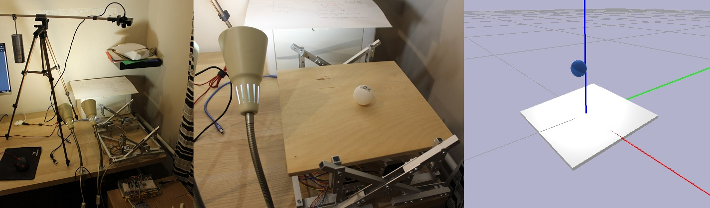
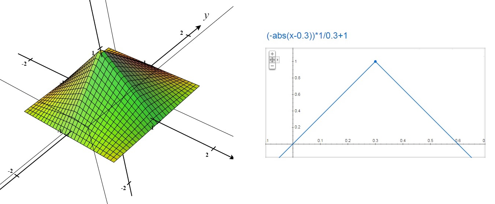
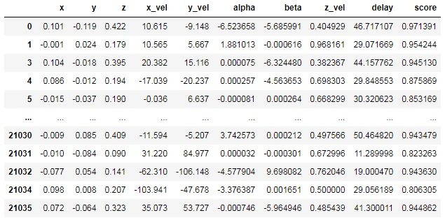
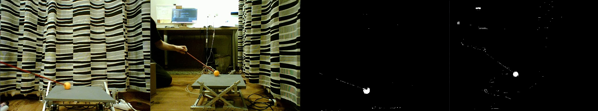
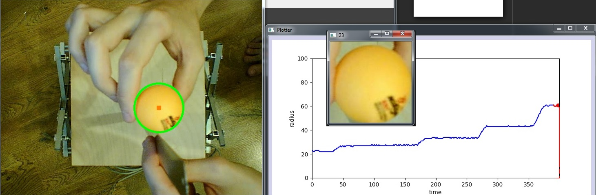
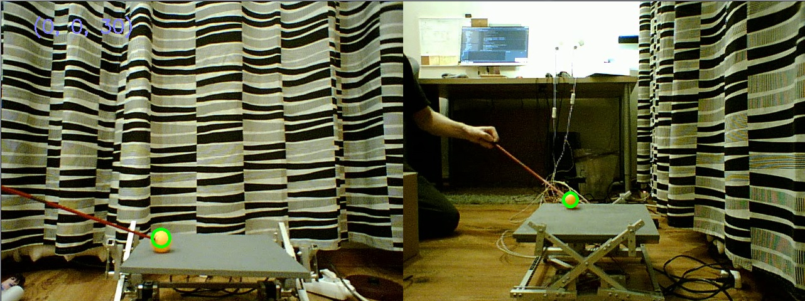
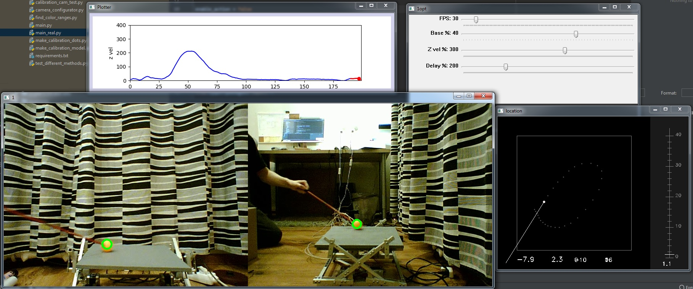

# Juggler platform

The robot tries to kick the ball up. The kicking platform can rotate on two axes and move vertically.
This repository includes an accurate physical simulation and a complete solution based on ML approach.

To apply the resulting model to the real platform, a program was made to determine the coordinates of the ball based on the video stream from two cameras.

[Video of Simulation](https://youtu.be/yQC6OHycJfw)

[Bigger video about CV and real platform](https://www.youtube.com/watch?v=z67J0S6FeP0)
 

## Abstract
It would be wise to divide the entire gaming experience into separate cases. Each case starts with a ball falling from some point and some speed x, y. The robot tries to kick the ball high enough and into the center of the platform. 
Case refers to the ball's coordinates and speed, and the robot's response in the form of the platform's tilt, its speed, and the delay in starting the movement:
* Coordinates of ball (x, y, z)
* Velocity of ball (x, y)
* Angles of platform (alpha, beta)
* Vertical velocity of platform (z-vel)
* Response delay (to kick the ball in time)

To run 1 simulation you need this input data.
After execution the program returns a score from 0 to 1 based on the three grades **A, B, C**.
* A — contact point location. The farther from the middle the worse it is
* B — maximum rebound height. The closer to the target altitude the better
* C — lifting of the platform at the moment of contact. The closer to the middle of the maximum lift the better. Necessary for the stable operation of the real device

Graphs of A and B. [Read more about math behind scores...](https://rust-donkey-1a4.notion.site/Juggling-robot-RL-solution-a3202e2119df45d9ae70768b8373bae2)

## Dataset making and preparation
First, we generate random coordinates of the ball and its speed. 
Then we check if the ball can touch the platform. If not, we discard this set, since the platform will not be able to hit it anyway. Good cases are saved in the file **01_checked_dots.csv**

Later steps described in data_preparation.ipynb

## Launch
To run the simulation, simply install the libraries from *requirements.txt* and run **main.py** in your IDE.

If you want to run a real robot, first connect the two cameras and the stepper motor controller. Then run the following files sequentially:
1. **find_color_ranges.py** For each camera, find the best values of thresholds at which the ball will be well recognized. Save the output numbers

2. **camera_configurator.py** Optional step since the last update. Find the best image processing parameters for stable ball detection

3. **make_calibration_dots.py** Move the ball to different coordinates to create a calibration file. After this step, try not to touch the cameras

4. **make_calibration_models.py** Just run it once
5. **main_real.py** Run. If the robot was connected, it will start kicking the ball!

### Debugging

* **data_preparation.ipynb** Contains details of data processing for action model training
* **make_calibration_model** Processing for calibration models
* **motor_tester.py** Simple motor tester with 5 textbox: 4 angles + delay time
* **motor_configurator.py** The program calculates the turning angles for each motor based on the two required angles. And sends to the motor controller
* **save_video.py** Simply records video from one camera for later debugging without actually connecting the camera. The video is saved in the /cam folder

## Conclusion
Although the algorithm works brilliantly well in the simulation, it is bad on a real device. Softening the movement of stepper motors and making parts on metalworking machines is required

[Technical details](https://docs.google.com/document/d/1umx8ZsqzESH3lx-r5ZVmqLn8rJtWfMUKcmMkzg1vBDY/edit?usp=sharing)